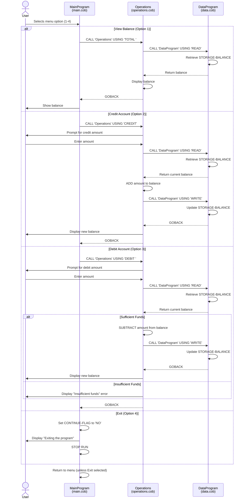

# Mergington High School - Student Account Management System

## Overview

This is a legacy COBOL-based accounting system used by Mergington High School to manage student financial accounts. The system handles student fees, cafeteria accounts, and school supplies purchases with a menu-driven interface for account management operations.

---

## COBOL File Documentation

### 1. **main.cob** - MainProgram (Entry Point)

**Purpose:** Primary user interface and program controller for the student account management system.

**Key Functions:**
- Presents a menu-driven interface with four options
- Manages program flow and user interaction loop
- Routes user selections to appropriate operations

**Menu Options:**
1. **View Balance** - Displays the current account balance
2. **Credit Account** - Adds funds to the student account
3. **Debit Account** - Withdraws funds from the student account
4. **Exit** - Terminates the program

**Business Logic:**
- Runs in a loop until user selects "Exit" (option 4)
- Validates user input and handles invalid selections gracefully
- Calls the `Operations` program with appropriate operation codes

**Key Data Structures:**
- `USER-CHOICE` (PIC 9): Stores the user's menu selection (1-4)
- `CONTINUE-FLAG` (PIC X(3)): Controls the main loop execution

---

### 2. **operations.cob** - Operations (Business Logic Handler)

**Purpose:** Implements all core business operations for account transactions and balance management.

**Key Functions:**

#### **TOTAL Operation - View Balance**
- Retrieves the current account balance from storage
- Displays the balance to the user
- Useful for: Students checking their account status, parents monitoring accounts

#### **CREDIT Operation - Add Funds**
- Prompts user to enter the credit amount
- Retrieves current balance
- Adds the credit amount to the balance
- Saves the updated balance to storage
- Displays confirmation with new balance
- Useful for: Depositing lunch money, paying fees, adding funds for school supplies

#### **DEBIT Operation - Withdraw Funds**
- Prompts user to enter the debit amount
- Validates sufficient funds availability (critical business rule)
- If funds are sufficient: Deducts the amount and updates storage
- If insufficient funds: Rejects transaction with error message
- Displays confirmation with new balance or error message
- Useful for: Charging lunch purchases, processing fee deductions, school supplies purchases

**Business Rules:**
- ✅ All transactions require balance validation
- ✅ Overdrafts are **NOT permitted** - transactions fail if insufficient funds
- ✅ Balances are stored with 2-decimal precision for currency (COBOL PIC 9(6)V99)
- ✅ Initial account balance: $1,000.00

**Key Data Structures:**
- `OPERATION-TYPE` (PIC X(6)): Stores the operation code (TOTAL, CREDIT, DEBIT)
- `AMOUNT` (PIC 9(6)V99): Stores transaction amount with 2 decimal places
- `FINAL-BALANCE` (PIC 9(6)V99): Stores the current account balance

---

### 3. **data.cob** - DataProgram (Data Persistence Layer)

**Purpose:** Manages data storage and retrieval operations. Acts as the central data repository for account balances.

**Key Functions:**

#### **READ Operation**
- Retrieves the stored balance from memory
- Called before displaying or calculating new balances
- Returns balance to the calling program

#### **WRITE Operation**
- Persists the updated balance to storage
- Called after any transaction (credit or debit) that modifies the balance
- Ensures data consistency across operations

**Data Storage:**
- `STORAGE-BALANCE` (PIC 9(6)V99): Central storage location for the account balance
- Default value: 1,000.00 (initial account funding)

**Linkage Protocol:**
- Receives operation code (READ or WRITE) and balance value
- Handles all data persistence operations
- Supports inter-program communication via CALL statements

---

## System Architecture

```
┌─────────────────────────────────────────────────────────┐
│                    MainProgram (main.cob)               │
│              (User Interface & Flow Control)             │
└───────────────────────┬─────────────────────────────────┘
                        │
                        │ CALL 'Operations' with operation
                        ↓
┌─────────────────────────────────────────────────────────┐
│                  Operations (operations.cob)             │
│            (Business Logic & Transaction Handler)        │
└───────────────────────┬─────────────────────────────────┘
                        │
                        │ CALL 'DataProgram' for READ/WRITE
                        ↓
┌─────────────────────────────────────────────────────────┐
│                DataProgram (data.cob)                    │
│              (Data Persistence Layer)                    │
└─────────────────────────────────────────────────────────┘
```

---

## Student Account Business Rules

### Account Types Supported
1. **Student Lunch/Cafeteria Account** - Charges for daily meal purchases
2. **School Fees Account** - Tracks tuition, facility, and technology fees
3. **School Supplies Account** - Manages purchases from school supply store

### Key Business Rules

| Rule | Description | Implementation |
|------|-------------|-----------------|
| **Minimum Balance** | Accounts cannot go negative (no overdrafts) | Debit validation in Operations |
| **Precision** | All amounts stored with 2 decimal places | PIC 9(6)V99 format |
| **Initial Funding** | New accounts start with $1,000.00 | Set in DataProgram WORKING-STORAGE |
| **Transaction Logging** | Each transaction updates central balance | READ/WRITE operations in DataProgram |
| **Real-time Updates** | Balance changes persist immediately | WRITE operation after each transaction |

### Account Balance Ranges
- **Minimum**: $0.00 (zero balance allowed, but no negative)
- **Maximum**: $999,999.99 (6-digit storage limit)

---

## Data Flow Example: Cafeteria Purchase

```
1. User selects "Debit Account" (option 3) in MainProgram
2. Operations program receives 'DEBIT ' operation
3. User prompted to enter purchase amount (e.g., $5.50)
4. Operations calls DataProgram READ → retrieves current balance
5. Operations validates: balance >= amount?
   - If YES: Subtract amount, call DataProgram WRITE, confirm transaction
   - If NO: Display "Insufficient funds" error message
6. User returned to main menu
```

---

## Technical Specifications

### Language & Platform
- **Language**: COBOL (Common Business-Oriented Language)
- **Original Release**: Early 1990s
- **Current Status**: Legacy system - target for modernization to Node.js

### Data Types
- Monetary values: `PIC 9(6)V99` (6-digit whole part + 2-digit decimal)
- Operation codes: `PIC X(6)` (6-character strings)
- User input: `PIC 9` (single digit 0-9)

### Inter-program Communication
- Uses COBOL CALL statements for modular architecture
- Parameters passed via LINKAGE SECTION
- Uses GOBACK to return control to calling program

---

## Future Modernization

This system is scheduled for modernization from COBOL to **Node.js** to:
- ✅ Improve developer accessibility (fewer COBOL specialists needed)
- ✅ Enable modern web-based interface for students and parents
- ✅ Integrate with modern school management systems
- ✅ Reduce maintenance costs and improve system agility
- ✅ Implement enhanced security and audit logging

---

## Support & Documentation

For questions about this legacy system or modernization efforts, please contact Mergington High School's IT Department.

**Created:** 2026  
**Last Updated:** August 2026  
**Status:** Target for modernization

---

## System Data Flow Sequence Diagram



**Key Data Flow Points:**

- **Balance Retrieval (READ)**: Operations requests current balance from DataProgram before any transaction
- **Balance Update (WRITE)**: After successful credit or debit, new balance is written back to DataProgram
- **Validation Logic**: Debit transactions check balance availability before allowing withdrawal
- **User Interaction**: MainProgram handles all user prompts; Operations performs calculations and balance updates
- **Error Handling**: Insufficient funds error prevents transaction and returns user to menu
